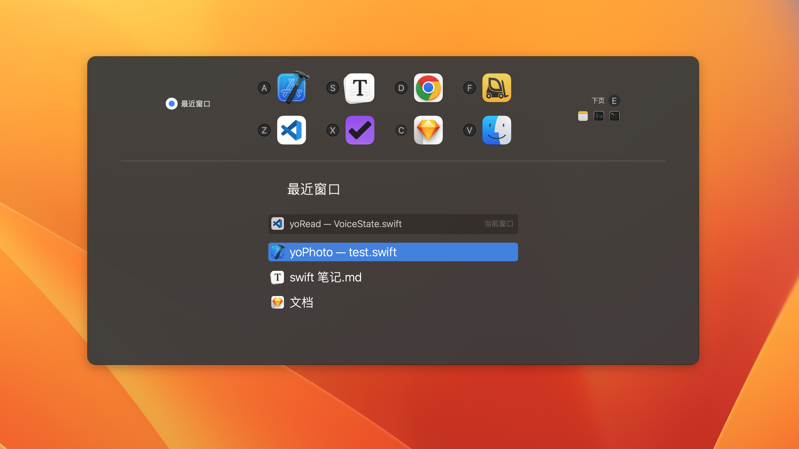
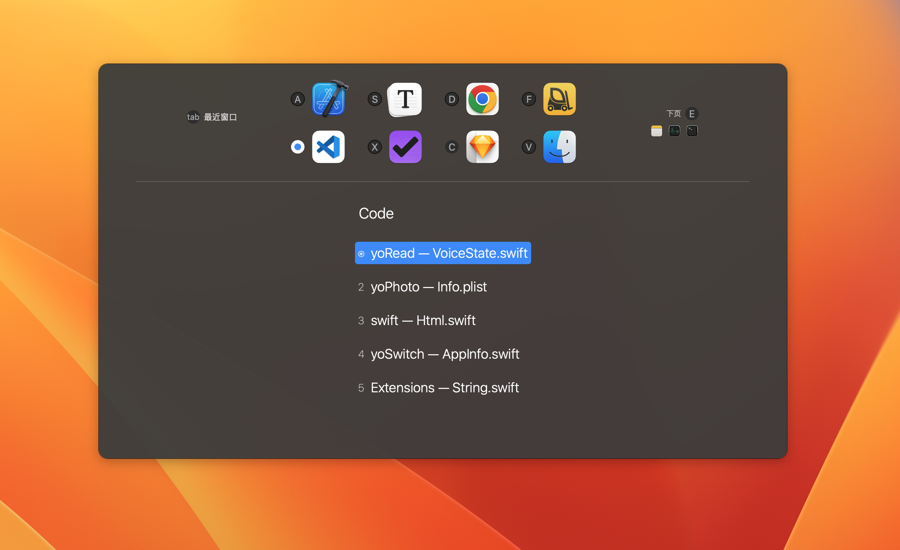

# yoSwitch

yoSwitch 让你能在任意应用和任意窗口间快速切换，避免因切换应用窗口导致注意力分散。

<<<<<<< HEAD
**[立即下载❯](https://gitee.com/yoodu/yoSwitch/releases/)			[备用链接❯](https://github.com/yoodu/yoSwitch/releases/latest/)**
=======
**[立即下载❯](https://gitee.com/yoodu/yoSwitch/releases/)           [备用链接❯](https://github.com/yoodu/yoSwitch/releases/latest/)**
>>>>>>> 4a4dd6088b85764d9307c6249e517e1c57845850

(支持MacOS 12 及以上系统 ) 

## 功能特点

#### 任意窗口切换

你可以在任意窗口间快速切换，即使窗口是在不同的应用、不同的桌面、不同的显示器

#### 支持盲切

多数时候你只需按 1 、 2 下按键，就能跳转到想要的窗口，不需要看键盘和面板

#### 单手操作

精心设计的按键交互，使操作集中在左手区，都能轻松触达，不用放开鼠标

## 使用说明

### 切换最近窗口

- ⌘ tab，连按选择最近窗口，松开按键跳转

### 选择应用和窗口

1. 按 ⌘ tab 打开面板后，按住 ⌘，并按字母键选中应用

2. 然后按数字键可选择该应用的窗口

3. 松开 ⌘ 键跳转

### 固定应用

将应用固定字母，以提高操作效率

拖动面板上的应用图标到需要固定的位置，只能固定在应用的第一页

